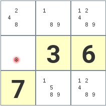
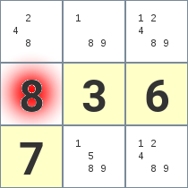
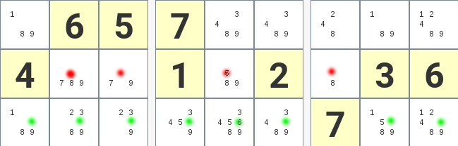
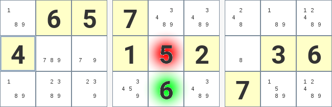

### Une seule valeur possible
#### Principe
Si une seule valeur est possible, alors on est sûr que c'est la valeur de la case
#### Avant

#### Après

### Seul endroit possible sur la ligne
#### Principe
Si il n'y a qu'une seule cellule dans la ligne qui accepte un chiffre, alors c'est dans cette cellule que le chiffre doit aller
#### Avant

#### Après

### Seul endroit possible sur la colonne
#### Principe
Si il n'y a qu'une seule cellule dans la colonne qui accepte un chiffre, alors c'est dans cette cellule que le chiffre doit aller
Voir [la même règle pour une ligne](#seul-endroit-possible-sur-la-ligne)

### Seul endroit possible sur le carré
#### Principe
Si il n'y a qu'une seule cellule dans le carré qui accepte un chiffre, alors c'est dans cette cellule que le chiffre doit aller
Voir [la même règle pour une ligne](#seul-endroit-possible-sur-la-ligne)

